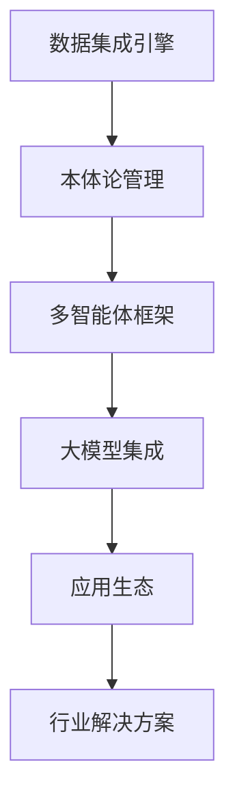

# Palantir技术路线与商业模式多智能体分析报告

## 执行摘要

本报告通过多智能体分析框架，深入解析Palantir的技术架构、商业模式，并提出在AI应用领域实现弯道超车的战略规划。

## 1. 多智能体分析框架

### 1.1 技术分析师 (Technology Analyst)
**职责**: 分析Palantir技术栈和架构实现

**核心发现**:
- **Foundry平台**: 基于本体论(Ontology)的数据集成平台
- **AIP平台**: 2023年4月推出的AI旗舰产品，集成大语言模型到私有网络
- **技术架构三层**: 数据&权限接入层、本体管理层、AI应用层
- **核心能力**: 数小时内解锁复杂数据资产(HyperAuto)

### 1.2 商业策略师 (Business Strategist)
**职责**: 分析商业模式和市场定位

**核心发现**:
- **收入来源**: 2024年美军合同达87.8亿人民币，政府业务占主导
- **产品矩阵**: Gotham(政府)、Foundry(企业)、Apollo(基础设施)、AIP(AI平台)
- **市场定位**: "决策操作系统"，从底层数据治理到顶层AI应用

### 1.3 研究合成师 (Research Synthesizer)
**职责**: 整合学术研究和开源实现

**核心发现**:
- **学术趋势**: 多智能体系统(MAS)成为AI应用新范式
- **开源框架**: AutoGen(微软)等成为多智能体开发标准
- **技术演进**: 从单一Agent到多Agent协同的转变

## 2. Palantir技术深度解析

### 2.1 核心技术栈

#### 2.1.1 Foundry平台架构
```
数据源层 → 数据集成层 → 本体管理层 → 应用层
    ↓          ↓            ↓          ↓
异构数据   HyperAuto     Ontology   AIP应用
```

**关键技术特性**:
- **无代码/低代码接口**: Pipeline Builder支持可视化数据管道构建
- **本体论管理**: 建立业务概念间的语义关系
- **数据血缘**: 完整的数据溯源能力

#### 2.1.2 AIP平台技术实现
- **大模型集成**: 在私有环境中激活AI代理
- **端到端应用**: 从战地决策到商业规划的全场景覆盖
- **权限控制**: 基于Foundry Ontology的细粒度权限管理

### 2.2 商业模式分析

#### 2.2.1 收入结构
- **政府业务**: 美军合同为主，2024年达12亿美元
- **商业客户**: 逐步扩展的企业级应用
- **定价模式**: 基于数据规模和复杂度的订阅制

#### 2.2.2 竞争优势
1. **技术壁垒**: 复杂数据集成和本体论管理的技术积累
2. **客户粘性**: 政府客户的长期合作关系
3. **生态闭环**: 从数据到决策的完整解决方案

## 3. 学术研究与开源实现分析

### 3.1 最新学术趋势

#### 3.1.1 多智能体系统研究
- **协作模式**: 专业化分工和高效协作机制
- **社会性Agent**: Agent社会的概念探索
- **应用场景**: 从单一任务到复杂业务流程的扩展

#### 3.1.2 企业级AI平台研究
- **数据治理**: 企业级数据血缘和权限管理
- **AI可解释性**: 决策过程的透明化要求
- **安全合规**: 隐私保护和合规性要求

### 3.2 开源技术栈

#### 3.2.1 多智能体框架
- **AutoGen**: 微软开源的多智能体协作框架
- **LangChain**: Agent工具调用和流程编排
- **CrewAI**: 专业化Agent团队协作框架

#### 3.2.2 数据平台技术
- **Apache Atlas**: 数据血缘和治理
- **Amundsen**: 数据发现和元数据管理
- **DataHub**: 现代数据目录平台

## 4. 弯道超车战略规划

### 4.1 技术路线图

#### 第一阶段: 基础能力建设 (0-6个月)
**目标**: 建立核心数据集成和本体论管理能力

**关键技术点**:
1. **数据集成引擎**: 借鉴HyperAuto思路，实现快速数据接入
2. **本体论框架**: 轻量级业务语义建模
3. **多智能体基础**: 基于开源框架的Agent系统

#### 第二阶段: AI能力集成 (6-12个月)
**目标**: 集成大模型和构建智能应用生态

**关键技术点**:
1. **大模型适配**: 国产大模型的深度集成
2. **Agent专业化**: 领域特定的智能体开发
3. **协作机制**: 多Agent协同决策框架

#### 第三阶段: 生态扩展 (12-24个月)
**目标**: 构建完整的AI应用开发生态

**关键技术点**:
1. **开放平台**: 第三方开发者和应用市场
2. **行业解决方案**: 垂直领域的深度定制
3. **国际化布局**: 全球市场拓展

### 4.2 商业模式创新

#### 4.2.1 差异化竞争策略
1. **本土化优势**: 深度理解国内企业需求
2. **成本优势**: 基于开源技术的成本优化
3. **敏捷开发**: 快速迭代和定制化能力

#### 4.2.2 收入模式设计
1. **分层定价**: 基础功能免费，高级功能收费
2. **生态分成**: 应用市场收入分成模式
3. **专业服务**: 定制化实施和咨询服务

### 4.3 实施路径

#### 4.3.1 技术实施步骤


#### 4.3.2 团队建设规划
- **核心技术团队**: 数据平台和AI算法专家
- **产品团队**: 用户体验和业务理解专家
- **生态团队**: 开发者关系和合作伙伴管理

## 5. 可行性分析与风险评估

### 5.1 技术可行性
**优势**:
- 开源技术成熟度较高
- 国内AI人才储备充足
- 云计算基础设施完善

**挑战**:
- 复杂数据集成技术门槛
- 大模型应用稳定性要求
- 企业级安全合规要求

### 5.2 市场可行性
**机会**:
- 国内企业数字化转型需求旺盛
- AI应用市场处于早期阶段
- 政策支持AI产业发展

**风险**:
- 国际巨头竞争压力
- 客户接受度需要时间培养
- 技术更新迭代速度快

### 5.3 风险应对策略
1. **技术风险**: 建立技术雷达，持续跟踪最新进展
2. **市场风险**: 采用MVP策略，快速验证产品市场匹配
3. **人才风险**: 建立完善的人才培养和留存机制

## 6. 结论与建议

### 6.1 核心结论
1. **技术可复制**: Palantir的核心技术基于成熟的开源技术栈
2. **市场机会**: 国内AI应用市场存在巨大空白
3. **时机恰当**: 多智能体技术为弯道超车提供可能

### 6.2 战略建议
1. **立即启动**: 组建核心团队，开始技术原型开发
2. **生态优先**: 优先构建开发者生态和应用市场
3. **聚焦垂直**: 选择2-3个垂直行业深度突破
4. **开放合作**: 与国内云厂商和大模型公司建立合作

---

**报告生成时间**: 2024年2月12日  
**分析框架**: 多智能体协同分析  
**数据来源**: 公开信息、学术研究、开源项目分析